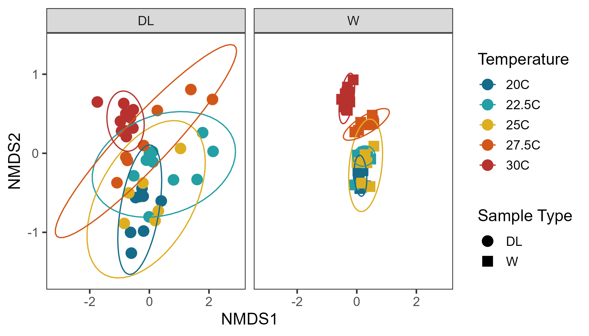

```{r setup, include=FALSE}
knitr::opts_chunk$set(echo = TRUE)
```

# Abstract

Pretend there is an incredibly informative abstract written here. 

# Introduction

The Northern Californian ecoregion displays high numbers of documented marine
introductions, which can pose major threats to ecosystem health and function. As of 2008, there were 85 introduced marine species identified in Northern California, 66% of which were considered ecologically harmful [@molnar_assessing_2008]. To prevent subsequent invasions, it is critical to fully understand which factors impact the success of non-native species. When non-native species are first introduced, they face a gauntlet of biotic and abiotic obstacles that determine whether they successfully establish a population [@crowl_spread_2008]. Of the abiotic factors, temperature is often considered the most limiting [@somero_thermal_2002], particularly for organisms that are ectothermic. Not only do invasive species typically tolerate a broad range of temperatures, a wider geographic range is correlated with a higher upper thermal limit, and invasive species are more likely to increase their upper thermal limit through acclimation [@kelley_role_2014]. While abiotic tolerance and asexual reproduction are frequently cited as important traits for invasion success in anemones [@gimenez_non-native_2021], the potential for anemone-associated microbial communities to mitigate temperature stress is largely unexplored. 

Broadly, microbial communities may include both obligate and transient
members, forming a network of symbiotic relationships that can be pathogenic, beneficial, or commensal in nature [@ayres_cooperative_2016]. Mutualist community members can provide beneficial services to their host, such as enhancing disease resistance [@lawley_targeted_2012; @rosado_marine_2019], improving nutrient acquisition [@roeselers_evolutionary_2012], and facilitating environmental acclimation. For example, green frog tadpoles that were depleted of their microbiota showed a substantial increase in gene expression under heat stress, suggesting the tadpole microbial community was effectively alleviating the stress response of the host [@fontaine_microbiome_2023]. Extensive research on the model anemone *Exaiptasia diaphana* has also highlighted the importance of host-microbe interactions in host resilience during bleaching events [@cziesielski_multi-omics_2018]. Similarly, transplanting bacteria from heat-acclimated *Nematostella vectensis* to bacteria-depleted anemones reduces mortality at high temperatures [@baldassarre_microbiota_2022]. Microbiota may alter host gene expression by generating molecules that directly bind to host transcription factors [@nichols_relationship_2020] or by producing metabolites that act as ligands for host proteins [@chen_forward_2019]. Although hosts may develop mechanisms to recruit and maintain beneficial bacteria from the environment [@nyholm_winnowing_2004], these mechanisms are not well understood in anemones. 

Once the anemone has recruited bacteria from the environment, it is advantageous to maintain and “buffer” their microbial community. Buffering is the anemone’s ability to guard their microbiota against environmental stress, maintaining community compositions markedly different from the surrounding water and preserving beneficial microbial community members [@hartman_effect_2020; @muller_stable_2016]. @hartman_effect_2020 proposed that there may be a temperature stress threshold at which significant community changes start to occur. In a two-year experiment, Exaiptasia diaphana reared at 32°C displayed higher richness and beta-diversity in their microbial community than anemones reared at 25°C [@ahmed_long-term_2019]. This pattern has been dubbed the ‘Anna Karenina Principle’, where beta-diversity is used as a proxy for host health and the stability of the community decreases under stressed conditions [@zaneveld_stress_2017]. Although prior work has largely focused on host resilience towards warming waters, using beta-diversity to identify microbial community stress could be further applied towards investigating temperature tolerance in invasive species during range expansion.

Here, I explore whether host-associated microbial communities have the capacity to enhance invasion success by investigating the widespread non-native anemone *Diadumene lineata*'s ability to maintain a stable microbial community at it's upper thermal limit.This work highlights the potential for *D. lineata* to be further developed as a model organism for investigating host selection mechanisms on microbial communities under a variety of abiotic stressors.

# Methods

After collection and cleaning, anemones were fed ahead of the experiment and recieved a fresh water change for optimal health. They were then be placed into a beaker together for 3 days to acclimate before being seperated for the temperature treatment (which will be for 3 more days). Seperating the anemones is important because if any die due to heat stress, it rapidly fouls the water. At the end of the trial, the anemones were be macerated in DNA/RNA shield. The water was collected and centrifuged, then the pellet was also preserved in DNA/RNA shield until the DNA can be extracted. Each treatment had n=10 anemones, however only 5 were selected for DNA extraction. Extra anemones were added to account for unpredictable death that can occur when the anemone was damaged during collection did not have time to regenerate. 

# Results

There was a significant difference in microbial community composition between temperature treatments (PERMANOVA F = 7.8337, P = 0.001 ***). There was still some overlap in composition between temperatures 20C-25C, with the community shifting at 27.5C and showing a substantial difference at 30C (Figure 1). See a posthoc pairwise comparison of treatments in Table 1.

```{r, out.width='80%', fig.align='center', fig.cap='NMDS ordination of the bacterial community composition on Diadumene lineata and the surrounding water. This is a single ordination that has been faceted by sample type for visibility. Ellipses for each temperature treatment represent standard error. k = 2, stress = 0.14, using a bray-curtis dissimilarity matrix.', echo=FALSE}



```


```{r table, out.width='100%', echo=FALSE}

# Import permanova results
perm = read.csv("../02_outdata/LivingData2024_AnemoneExp2PERMAPAIR_2024-09-22.csv")

# Remove first column containing just numbers
perm = subset(perm, select=-c(X))

# Make table of results
knitr::kable(perm, align = "l", caption = "Output of a pairwise comparison of the PERMANOVA for temperature treatment using a bray-curtis dissimilarity matrix, 999 permuations, and the Benjamini-Hochberg p-value adjustment for multiple comparisons.")

```

# Discussion

Pretend there is a detailed and nuanced discussion of the results written up here. 

# References
